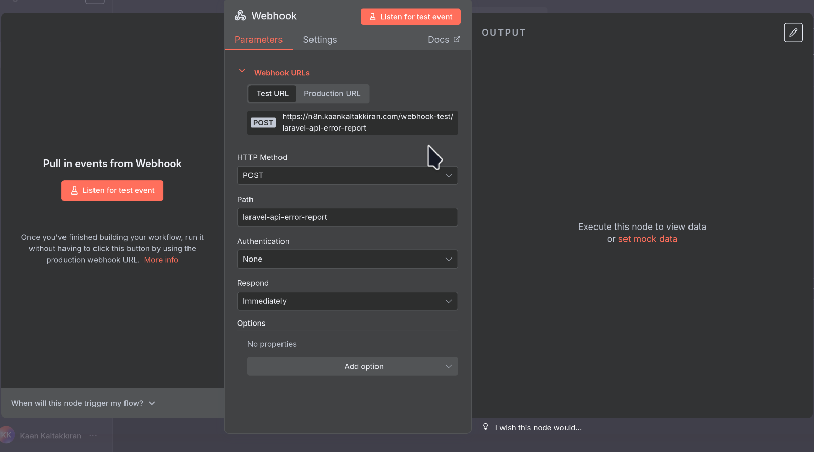
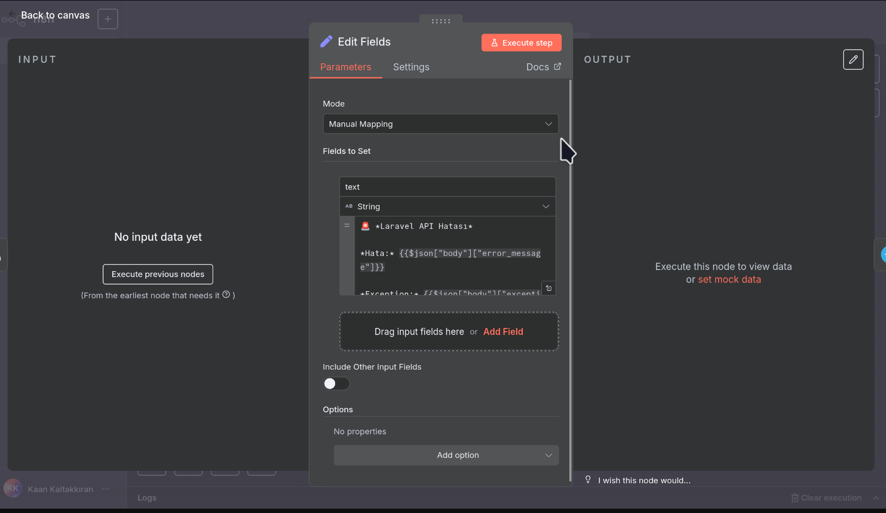
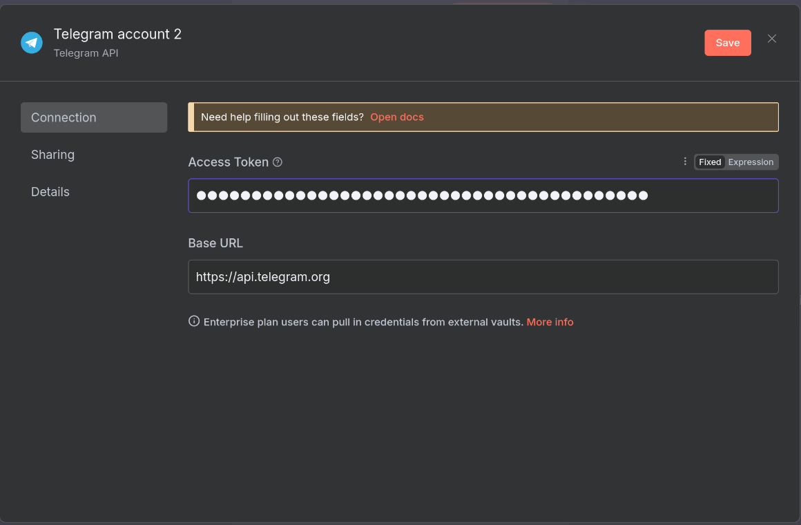
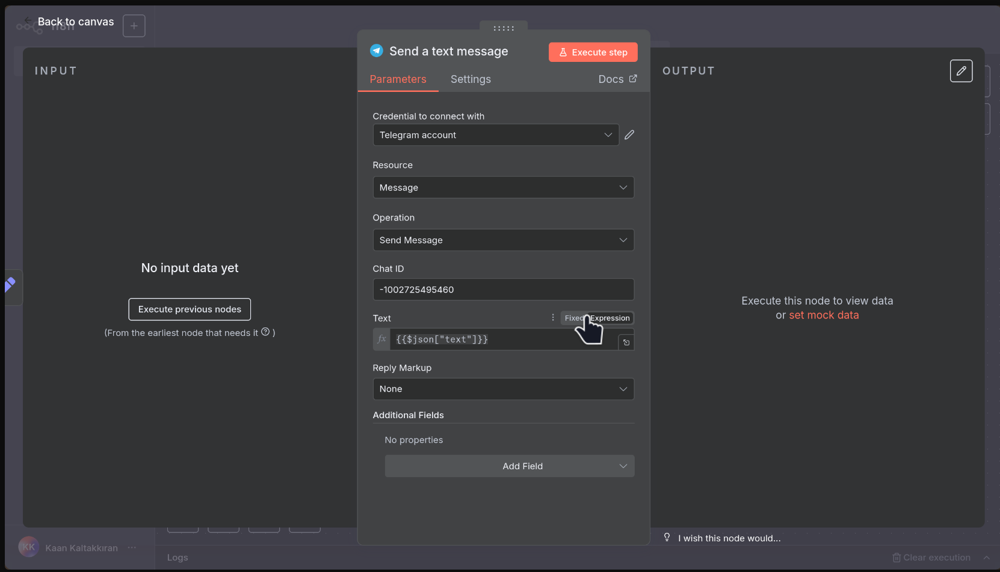
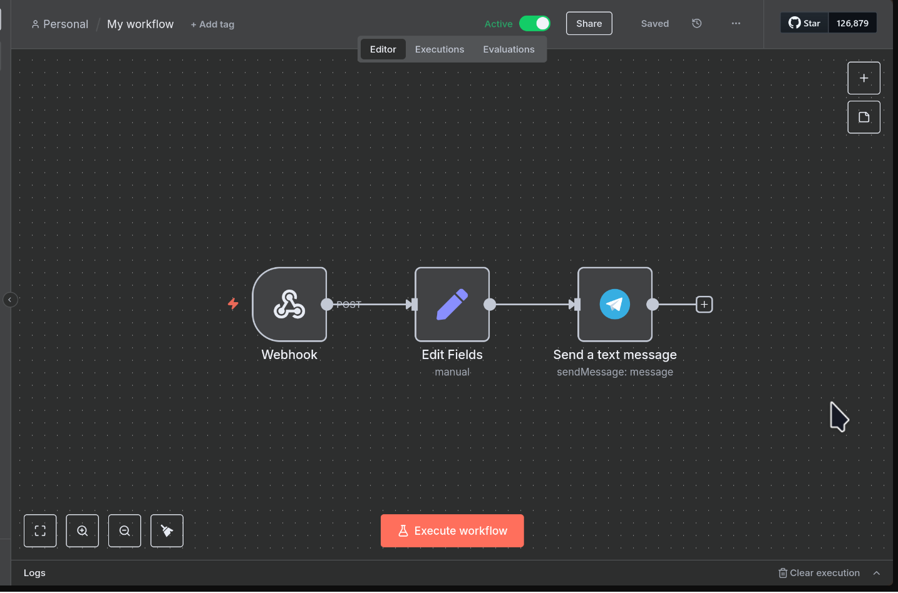
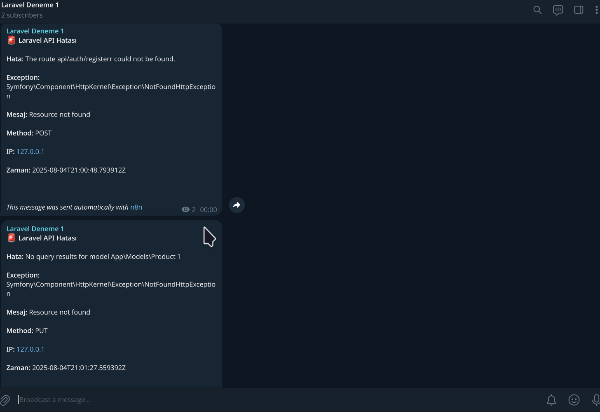

# N8N Telegram Bot Hata Yönetimi Rehberi

Bu rehber laravel api projenizde api isteklerinde hata olduğu zaman telegram botunuz size hataları bildirmesini sağlar.

Bu rehber, Laravel 12 API uygulandaki hataları Telegram kanalına iletmek için:

- Laravel'in mevcut exception handler yapısını,
- n8n Webhook'u,
- Telegram Bot API'sini

kullanır.

## Adım 1: Telegram Bot Token'ını Alma

1. Telegram’da **@BotFather**’ı bulun ve `/start` komutunu gönderin.
2. `/newbot` komutunu seçin ve botunuza bir **isim** ve **kullanıcı adı** (username) verin.
3. BotFather size bir **HTTP API Token** verecek. Bu token’ı daha sonra `.env` dosyanıza ekleyeceğiz.

```bash
TELEGRAM_BOT_TOKEN=YOUR_BOT_TOKEN
```

> **Not:** Telegram bot tokeni `.env` eklemeniz sadece tokeni güvenli bir yerde tutmanız içindir. Laravel projesinde bu token kullanılmayacaktır.

## Adım 2: Telegram Kanal Oluşturma Ve Kanal ID'yi Alma

Aşağıdaki adımları takip ederek Telegram kanalınızı oluşturun:

1. **Telegram’ı aç** (mobil ya da masaüstü).
2. Sağ üstten **"Yeni Mesaj" → "Yeni Kanal"** seç.
3. Kanal ismini ve açıklamasını gir, **"İleri"**'ye tıkla.
4. Kanal türünü **Genel** olarak ayarla.
5. Genel bağlantı adını oluştur ve sağ yukarda onay butonuna tıkla.
6. Abone ekle kısmından arama kısmına **oluşturduğunuz telegram botunun** ismini(usurname) yaz ve kanala ekle.

Aşağıdaki adımları takip ederek Telegram botunuzu kanalınıza ekleyin:

1. Oluşturduğun kanalı aç ve kanal ismine tıkla.
2. **Yöneticiler > Yönetici Ekle** bölümüne gir.
3. Bot kullanıcı adını yaz(bot usurname):

   - Örneğin: `@my_awesome_bot`

4. Botu bulunca sağ üste yer alan tick butonuna tıkla.

5. Botun yönetici olarak görünmesi gerekiyor.

Aşağıdaki adımları takip ederek Telegram kanalının ID'sini alabilirsiniz:

1. Chat ID'yi almak için oluşturduğunuz `botun token'ini` kullanarak aşağıdaki URL'yi açın:

```bash
https://api.telegram.org/bot<TOKEN>/getUpdates
```

2. `4.adımda` oluşturduğunuz kanala mesaj gönderin.
3. Açtığınız url sayfayı yenileyin.

Bu URL'yi açtığınızda bir JSON cevabı alacaksınız. Bu JSON'da `chat_id` değerini bulabilirsiniz.

Örnek JSON cevabı:

```json
{
  "ok": true,
  "result": [
    {
      "update_id": 82672471,
      "channel_post": {
        "message_id": 3,
        "sender_chat": {
          "id": -1001234567890,
          "title": "Laravel Deneme 1",
          "username": "laravel_try1",
          "type": "channel"
        },
        "chat": {
          "id": -1001234567895,
          "title": "Laravel Deneme 1",
          "username": "laravel_try1",
          "type": "channel"
        },
        "date": 1754293378,
        "text": "Deneme"
      }
    }
  ]
}
```

Chat ID'yi `.env` dosyasına ekleyin:

```bash
TELEGRAM_CHAT_ID=-1001234567895
```

> **Not:** Telegram kanal ID'sini `.env` eklemeniz sadece tokeni güvenli bir yerde tutmanız içindir. Laravel projesinde bu token kullanılmayacaktır.

## Adım 3: Kod Konfigürasyonu

`ApiExceptionHandler.php` dosyasını oluşturma:

```bash
mkdir -p app/Exceptions
touch app/Exceptions/ApiExceptionHandler.php
```

<details>
<summary><b>ApiExceptionHandler.php</b></summary>

```php
<?php
namespace App\Exceptions;

use Illuminate\Auth\Access\AuthorizationException;
use Illuminate\Auth\AuthenticationException;
use Illuminate\Database\Eloquent\ModelNotFoundException;
use Illuminate\Database\QueryException;
use Illuminate\Http\JsonResponse;
use Illuminate\Http\Request;
use Illuminate\Support\Facades\Http;
use Illuminate\Support\Facades\Log;
use Illuminate\Validation\ValidationException;
use Symfony\Component\HttpKernel\Exception\AccessDeniedHttpException;
use Symfony\Component\HttpKernel\Exception\HttpException;
use Symfony\Component\HttpKernel\Exception\MethodNotAllowedHttpException;
use Symfony\Component\HttpKernel\Exception\NotFoundHttpException;
use Throwable;

class ApiExceptionHandler
{
    /**
     * Map of exception classes to their handler methods
     */
    public static array $handlers = [
        AuthenticationException::class => 'handleAuthenticationException',
        AccessDeniedHttpException::class => 'handleAuthenticationException',
        AuthorizationException::class => 'handleAuthorizationException',
        ValidationException::class => 'handleValidationException',
        ModelNotFoundException::class => 'handleNotFoundException',
        NotFoundHttpException::class => 'handleNotFoundException',
        MethodNotAllowedHttpException::class => 'handleMethodNotAllowedException',
        HttpException::class => 'handleHttpException',
        QueryException::class => 'handleQueryException',
    ];

    /**
     * Handle authentication exceptions
     */
    public function handleAuthenticationException(
        AuthenticationException | AccessDeniedHttpException $e,
        Request $request
    ): JsonResponse {
        $this->logException($e, 'Authentication failed');

        return response()->json([
            'error' => [
                'type' => $this->getExceptionType($e),
                'status' => 401,
                'message' => 'Authentication required. Please provide valid credentials.',
                'timestamp' => now()->toISOString(),
            ],
        ], 401);
    }

    /**
     * Handle authorization exceptions
     */
    public function handleAuthorizationException(
        AuthorizationException $e,
        Request $request
    ): JsonResponse {
        $this->logException($e, 'Authorization failed');

        return response()->json([
            'error' => [
                'type' => $this->getExceptionType($e),
                'status' => 403,
                'message' => 'You do not have permission to perform this action.',
                'timestamp' => now()->toISOString(),
            ],
        ], 403);
    }

    /**
     * Handle validation exceptions
     */
    public function handleValidationException(
        ValidationException $e,
        Request $request
    ): JsonResponse {
        $errors = [];

        foreach ($e->errors() as $field => $messages) {
            foreach ($messages as $message) {
                $errors[] = [
                    'field' => $field,
                    'message' => $message,
                ];
            }
        }

        $this->logException($e, 'Validation failed', ['errors' => $errors]);

        return response()->json([
            'error' => [
                'type' => $this->getExceptionType($e),
                'status' => 422,
                'message' => 'The provided data is invalid.',
                'timestamp' => now()->toISOString(),
                'validation_errors' => $errors,
            ],
        ], 422);
    }

    /**
     * Handle not found exceptions
     */
    public function handleNotFoundException(
        ModelNotFoundException | NotFoundHttpException $e,
        Request $request
    ): JsonResponse {
        $this->logException($e, 'Resource not found');

        $message = $e instanceof ModelNotFoundException
        ? 'The requested resource was not found.'
        : "The requested endpoint '{$request->getRequestUri()}' was not found.";

        return response()->json([
            'error' => [
                'type' => $this->getExceptionType($e),
                'status' => 404,
                'message' => $message,
                'timestamp' => now()->toISOString(),
            ],
        ], 404);
    }

    /**
     * Handle method not allowed exceptions
     */
    public function handleMethodNotAllowedException(
        MethodNotAllowedHttpException $e,
        Request $request
    ): JsonResponse {
        $this->logException($e, 'Method not allowed');

        return response()->json([
            'error' => [
                'type' => $this->getExceptionType($e),
                'status' => 405,
                'message' => "The {$request->method()} method is not allowed for this endpoint.",
                'timestamp' => now()->toISOString(),
                'allowed_methods' => $e->getHeaders()['Allow'] ?? 'Unknown',
            ],
        ], 405);
    }

    /**
     * Handle general HTTP exceptions
     */
    public function handleHttpException(HttpException $e, Request $request): JsonResponse
    {
        $this->logException($e, 'HTTP exception occurred');

        return response()->json([
            'error' => [
                'type' => $this->getExceptionType($e),
                'status' => $e->getStatusCode(),
                'message' => $e->getMessage() ?: 'An HTTP error occurred.',
                'timestamp' => now()->toISOString(),
            ],
        ], $e->getStatusCode());
    }

    /**
     * Handle database query exceptions
     */
    public function handleQueryException(QueryException $e, Request $request): JsonResponse
    {
        $this->logException($e, 'Database query failed', ['sql' => $e->getSql()]);

        // Handle specific database constraint violations
        $errorCode = $e->errorInfo[1] ?? null;

        switch ($errorCode) {
            case 1451: // Foreign key constraint violation
                return response()->json([
                    'error' => [
                        'type' => $this->getExceptionType($e),
                        'status' => 409,
                        'message' => 'Cannot delete this resource because it is referenced by other records.',
                        'timestamp' => now()->toISOString(),
                    ],
                ], 409);

            case 1062: // Duplicate entry
                return response()->json([
                    'error' => [
                        'type' => $this->getExceptionType($e),
                        'status' => 409,
                        'message' => 'A record with this information already exists.',
                        'timestamp' => now()->toISOString(),
                    ],
                ], 409);

            default:
                return response()->json([
                    'error' => [
                        'type' => $this->getExceptionType($e),
                        'status' => 500,
                        'message' => 'A database error occurred. Please try again later.',
                        'timestamp' => now()->toISOString(),
                    ],
                ], 500);
        }
    }

    /**
     * Extract a clean exception type name
     */
    private function getExceptionType(Throwable $e): string
    {
        $className = basename(str_replace('\\', '/', get_class($e)));
        return $className;
    }
    private function notifyToTelegram(array $data): void
    {
        try {
            Http::post(env('N8N_WEBHOOK_URL'), $data);
        } catch (\Throwable $e) {
            Log::error('Telegram bildirimi gönderilemedi', [
                'exception' => $e->getMessage(),
            ]);
        }
    }

    /**
     * Log exception with context
     */
    private function logException(Throwable $e, string $message, array $context = []): void
    {
        $logContext = array_merge([
            'exception' => get_class($e),
            'message' => $e->getMessage(),
            'file' => $e->getFile(),
            'line' => $e->getLine(),
            'url' => request()->fullUrl(),
            'method' => request()->method(),
            'ip' => request()->ip(),
        ], $context);

        Log::warning($message, $logContext);

        // Telegram bildirimi gönder
        $this->notifyToTelegram([
            'message' => $message,
            'exception' => get_class($e),
            'error_message' => $e->getMessage(),
            'url' => request()->fullUrl(),
            'method' => request()->method(),
            'ip' => request()->ip(),
            'timestamp' => now()->toISOString(),
        ]);
    }

}
```

</details>

`bootstrap/app.php` dosyasını düzenleyin:

<details>

<summary><b>app.php</b></summary>

```php
<?php
// bootstrap/app.php
use App\Exceptions\ApiExceptionHandler;
use Illuminate\Foundation\Application;
use Illuminate\Foundation\Configuration\Exceptions;
use Illuminate\Foundation\Configuration\Middleware;

return Application::configure(basePath: dirname(__DIR__))
    ->withRouting(
        // Web rotalarının dosya yolu.
        web: __DIR__ . '/../routes/web.php',

        // API rotalarının dosya yolu.
        api: __DIR__ . '/../routes/api.php',

        // API rotalarının prefix'ini belirtir.
        apiPrefix: 'api',

        // Komut dosyasının dosya yolu.
        commands: __DIR__ . '/../routes/console.php',

        // Sağlık rotalarının dosya yolu.
        health: '/up',
    )

    ->withMiddleware(function (Middleware $middleware): void {
        $middleware->alias([
            'jwt.auth' => \PHPOpenSourceSaver\JWTAuth\Http\Middleware\Authenticate::class,
            'jwt.refresh' => \PHPOpenSourceSaver\JWTAuth\Http\Middleware\RefreshToken::class,
        ]);
    })
    ->withExceptions(function (Exceptions $exceptions) {
        $exceptions->render(function (Throwable $e, $request) {
            $handler = new ApiExceptionHandler();

            foreach (ApiExceptionHandler::$handlers as $class => $method) {
                if ($e instanceof $class && method_exists($handler, $method)) {
                    return $handler->$method($e, $request);
                }
            }

            // default fallback
            return response()->json([
                'error' => [
                    'type' => (new \ReflectionClass($e))->getShortName(),
                    'status' => $e instanceof \Symfony\Component\HttpKernel\Exception\HttpExceptionInterface
                    ? $e->getStatusCode()
                    : 500,
                    'message' => $e->getMessage() ?: 'Server error',
                    'timestamp' => now()->toISOString(),
                ],
            ], $e instanceof \Symfony\Component\HttpKernel\Exception\HttpExceptionInterface
                ? $e->getStatusCode()
                : 500);
        });
    })
    ->create();
```

</details>

## N8N Workflow Oluşturma Ve Telagram Bot Ayarları

`Create workflow` butonuna tıklayarak yeni bir workflow oluşturun.

### Adım 1: `Webhook` Node Ekle

`Add First Step` butonuna tıklayarak sağ tarafta açılan yere `Webhook` arayarak nodu seç ve ekle.

Aşağıdaki ayarları yap:

`HTTP Method` kısmında seç:

```bash
POST
```

`Path` kısmına yaz:

```bash
laravel-api-error-report
```

> **Not:** `path` kısmına istediğin bir şey yazabilirsin.

`Webhook url's` kısmında 2 adet url var.

1. Test url test için kullanmanız gereken url'dir. Örnek:`https://<n8n-sunucu-adresiniz>/webhook-test/laravel-api-error-report`

2. Production url production için kullanmanız gereken url'dir. Örnek:`https://<n8n-sunucu-adresiniz>/webhook/laravel-api-error-report`

> Bu URL'yi `.env` dosyasında `N8N_WEBHOOK_URL=https://<n8n-sunucu-adresiniz>/webhook/laravel-api-error-report` olarak ekleyin.

> **Not:** Eğer daha test etme aşamasındaysanız `test url` linkini `env` dosyasına ekleyin. Artık çalışır duruma geldikten sonra `production url` linkini `env` dosyasına ekleyin.

Örnek Ayarlar:



### Adım 2: `Edit Fields(set)` Node Ekle

Webhooktan çıkan `+` butonuna tıkla. Sağ tarafta açılan yere `Edit Fields(set)` yazarak nodu ekle.

Aşağıdaki ayarları yap:

`Fields to Set` e tıkla.

`name` kısmına yapıştır:

```bash
text
```

`type` kısmında seç:

```bash
String
```

`value` kısmına yapıştır:

```bash
🚨 *Laravel API Hatası*

*Hata:* {{$json["body"]["error_message"]}}

*Exception:* {{$json["body"]["exception"]}}

*Mesaj:* {{$json["body"]["message"]}}

*Method:* {{$json["body"]["method"]}}

*IP:* {{$json["body"]["ip"]}}

*Zaman:* {{$json["body"]["timestamp"]}}
```

Örnek Ayarlar:



### Adım 3: `Telegram` Node Ekle

Webhooktan çıkan `+` butonuna tıkla. Sağ tarafta açılan yere `telegram` yaz ve seç.

Daha sonra açılan `actions` kısmından `Send a text message` seç.

Aşağıdaki ayarları yap:

`Credential to connect with` kısmından `create a new credential` seç. Daha sonra açılan kısımda `Bot Token` kısmına Telegram Bot’un API token'ını yaz ve kaydet.



`Chat ID` kısmına kanalın chat ID'sini yaz.

`text` kısmına yapıştır:

```bash
{{$json["text"]}}
```

Örnek Ayarlar:



## Test Etme

Tüm ayarlar bitti. Eğer her şey doğru bir şekilde ayarlandıysa otomasyon çalışacaktır.

[N8N Workflow Dosyası](https://github.com/kaankaltakkiran/Linux_notlarim/blob/main/php_notlarim/notlarim/laravel_api_notlarim/notlarim/laravel_api_error_handle_n8n_telegram_bot.json) `n8n` import ederek workflow oluşturabilirsiniz.

> **Not:** İmport ettikten sonra `Telegram bot token` ve `Chat ID` kısmını ayarlamalısınız.

Örnek Workflow:



Test aşamasında `test url` linkini kullanarak test edebilirsiniz. `Execute workflow` butonuna tıklayıp daha sonra hatalı bir api isteği atarak test edebilirsiniz.

Üst tarafta yer alan `inactive` butonuna tıklayarak workflow aktif edin.

> **Not:** `env` dosyasında `N8N_WEBHOOK_URL` linkiniz `production url` linki olmalıdır.

Örnek Mesaj:


