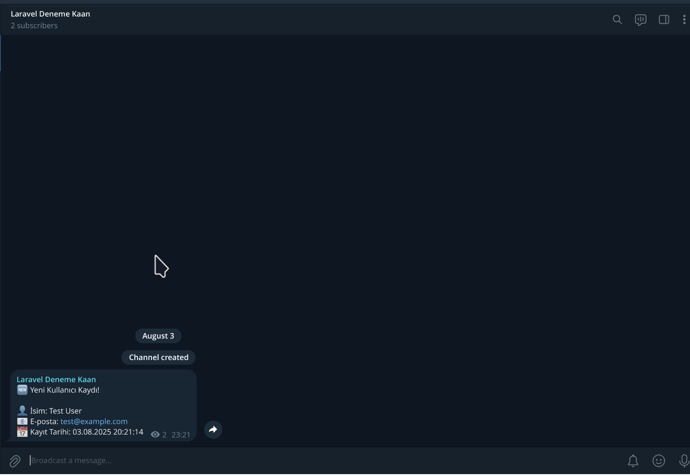

# Laravel Telegram Bot Rehberi

# Laravel Telegram Bot Entegrasyonu Ders Notu

## ÖZET

```bash
# Proje dizinine geçin
cd laravel_telegram_bot

# Telegram Bot SDK paketini yükleyin
composer require irazasyed/telegram-bot-sdk

# Telegram Bot için yapılandırma dosyasını yayınlama
php artisan vendor:publish --tag="telegram-config"

# Telegram bot oluşturma ve bot token'ını alma

# Telegram bot kanal oluşturma ve kanal ID'ini alma

# Event ve Listener oluştur
php artisan make:event UserRegistered
php artisan make:listener SendTelegramNotification --event=UserRegistered

# composer.json dosyasını güncelle
composer dump-autoload
php artisan config:clear
php artisan cache:clear

# UserRegistered dosyasını güncelle

# SendTelegramNotification dosyasını güncelle

# AppServiceProvider.php dosyasını güncelle

# AuthController.php dosyasını güncelle

# Geliştirme sunucusunu başlat
php artisan serve

# Register api isteğini test et
curl -X POST http://127.0.0.1:8000/api/auth/register \
  -H "Content-Type: application/json" \
  -H "Accept: application/json" \
  -d '{
    "name": "Test User",
    "email": "test@example.com",
    "password": "password123",
    "password_confirmation": "password123"
  }'
```

## Giriş

Bu ders notunda Laravel projesine [irazasyed/telegram-bot-sdk](https://telegram-bot-sdk.com/) paketi kullanarak Telegram bot nasıl entegre edileceğini adım adım öğreneceksiniz.

Bu rehberi uygulamadan önce hali hazırda bir Laravel projesi olmalı.

Bu rehber için [örnek laravel jwt rehberini ](https://github.com/nuriakman/kamp-2025-yaz/blob/main/laravel-API-notlar/DERS-NOTU-JWT.md) tamamladıktan sonra bu rehberi takip etmeniz önerilir.

Bu örnekte kullanıcı kayıt olduğunda Telegram bot'a mesaj göndermesini sağlayan bir Telegram bot entegrasyonu yapacağız.

## Gereksinimler

- Laravel 12.x projesi
- PHP 8.2+
- Composer

## Adım 1: Telegram Bot SDK Paketini Yükleme

Öncelikle `irazasyed/telegram-bot-sdk` paketini projenize yükleyin:

```bash
composer require irazasyed/telegram-bot-sdk
```

Bu komut paketi ve bağımlılıklarını yükleyecektir.

## Adım 2: Telegram Bot Konfigürasyonunu Yayınlama

Telegram Bot konfigürasyon dosyasını projenize kopyalayın:

```bash
php artisan vendor:publish --tag="telegram-config"
```

Bu komut `config/telegram.php` dosyasını oluşturacaktır.

## Adım 3: Telegram Bot Token'ını Alma Ve .env Dosyasına Ekleme

1. Telegram’da **@BotFather**’ı bulun ve `/start` komutunu gönderin.
2. `/newbot` komutunu seçin ve botunuza bir **isim** ve **kullanıcı adı** (username) verin.
3. BotFather size bir **HTTP API Token** verecek. Bu token’ı daha sonra `.env` dosyanıza ekleyeceğiz.

```bash
TELEGRAM_BOT_TOKEN=YOUR_BOT_TOKEN
```

## Adım 4: Telegram Kanal Oluşturma Ve Kanal ID'yi Alma

Aşağıdaki adımları takip ederek Telegram kanalınızı oluşturun:

1. **Telegram’ı aç** (mobil ya da masaüstü).
2. Sağ üstten **"Yeni Mesaj" → "Yeni Kanal"** seç.
3. Kanal ismini ve açıklamasını gir, **"İleri"**'ye tıkla.
4. Kanal türünü **Genel** olarak ayarla.
5. Genel bağlantı adını oluştur ve sağ yukarda onay butonuna tıkla.
6. Abone ekle kısmından arama kısmına **oluşturduğunuz telegram botunun** ismini(usurname) yaz ve kanala ekle.

Aşağıdaki adımları takip ederek Telegram botunuzu kanalınıza ekleyin:

1. Oluşturduğun kanalı aç ve kanal ismine tıkla.
2. **Yöneticiler > Yönetici Ekle** bölümüne gir.
3. Bot kullanıcı adını yaz(bot usurname):

   - Örneğin: `@my_awesome_bot`

4. Botu bulunca sağ üste yer alan tick butonuna tıkla.

5. Botun yönetici olarak görünmesi gerekiyor.

Aşağıdaki adımları takip ederek Telegram kanalının ID'sini alabilirsiniz:

1. Chat ID'yi almak için oluşturduğunuz `botun token'ini` kullanarak aşağıdaki URL'yi açın:

```bash
https://api.telegram.org/bot<TOKEN>/getUpdates
```

2. `4.adımda` oluşturduğunuz kanala mesaj gönderin.
3. Açtığınız url sayfayı yenileyin.

Bu URL'yi açtığınızda bir JSON cevabı alacaksınız. Bu JSON'da `chat_id` değerini bulabilirsiniz.

Örnek JSON cevabı:

```json
{
  "ok": true,
  "result": [
    {
      "update_id": 82672471,
      "channel_post": {
        "message_id": 3,
        "sender_chat": {
          "id": -1001234567890,
          "title": "Laravel Deneme 1",
          "username": "laravel_try1",
          "type": "channel"
        },
        "chat": {
          "id": -1001234567895,
          "title": "Laravel Deneme 1",
          "username": "laravel_try1",
          "type": "channel"
        },
        "date": 1754293378,
        "text": "Deneme"
      }
    }
  ]
}
```

Chat ID'yi `.env` dosyasına ekleyin:

```bash
TELEGRAM_CHAT_ID=-1001234567895
```

## Adım 5: Örnek Kullanım

Kullanıcı kayıt olduğunda Telegram bot'a mesaj gönderilmesi için `app/Http/Controllers/Api/AuthController.php` dosyasını güncelleyin:

> **Not:** Bu adım kullanım olarak tavsiye edilmez. 6. adımda event ve listener kullanarak daha profesyonel bir şekilde yapabilirsiniz.

<details>
<summary><b>AuthController.php</b></summary>

```php
<?php

namespace App\Http\Controllers\Api;

use App\Http\Controllers\Controller;
use App\Models\User;
use Illuminate\Http\Request;
use Illuminate\Support\Facades\Auth;
use Illuminate\Support\Facades\Hash;
use Illuminate\Support\Facades\Log;
use Illuminate\Support\Facades\Validator;
use PHPOpenSourceSaver\JWTAuth\Facades\JWTAuth;
use Telegram\Bot\Api;

class AuthController extends Controller
{
    protected $telegram;
    /**
     * Create a new AuthController instance.
     *
     * @return void
     */
    public function __construct()
    {
        // Middleware route seviyesinde tanımlandı
        $this->telegram = new Api(env('TELEGRAM_BOT_TOKEN'));

    }

    /**
     * Get a JWT via given credentials.
     *
     * @return \Illuminate\Http\JsonResponse
     */
    public function login(Request $request)
    {
        $validator = Validator::make($request->all(), [
            'email' => 'required|email',
            'password' => 'required|string|min:6',
        ]);

        if ($validator->fails()) {
            return response()->json($validator->errors(), 422);
        }

        if (!$token = Auth::guard('api')->attempt($validator->validated())) {
            return response()->json(['error' => 'Unauthorized'], 401);
        }

        return $this->createNewToken($token);
    }

    /**
     * Register a User.
     *
     * @return \Illuminate\Http\JsonResponse
     */
    public function register(Request $request)
    {
        $validator = Validator::make($request->all(), [
            'name' => 'required|string|between:2,100',
            'email' => 'required|string|email|max:100|unique:users',
            'password' => 'required|string|confirmed|min:6',
        ]);

        if ($validator->fails()) {
            return response()->json($validator->errors()->toJson(), 400);
        }

        $user = User::create(array_merge(
            $validator->validated(),
            ['password' => Hash::make($request->password)]
        ));
        // register metodunda kullanıcı oluşturduktan sonra
        $this->sendTelegramNotification($user); // Bu satırı ekledik

        return response()->json([
            'message' => 'User successfully registered',
            'user' => $user,
        ], 201);
    }
    protected function sendTelegramNotification(User $user)
    {
        try {
            $message = "🆕 Yeni Kullanıcı Kaydı!\n\n";
            $message .= "👤 İsim: " . $user->name . "\n";
            $message .= "📧 E-posta: " . $user->email . "\n";
            $message .= "📅 Kayıt Tarihi: " . $user->created_at->format('d.m.Y H:i:s');

            $this->telegram->sendMessage([
                'chat_id' => env('TELEGRAM_CHAT_ID'),
                'text' => $message,
                'parse_mode' => 'HTML',
            ]);
        } catch (\Exception $e) {
            Log::error('Telegram Hatası: ' . $e->getMessage());

        }
    }

    /**
     * Log the user out (Invalidate the token).
     *
     * @return \Illuminate\Http\JsonResponse
     */
    public function logout()
    {
        Auth::guard('api')->logout();

        return response()->json(['message' => 'Successfully logged out']);
    }

    /**
     * Refresh a token.
     *
     * @return \Illuminate\Http\JsonResponse
     */
    public function refresh()
    {
        try {
            $newToken = JWTAuth::refresh(JWTAuth::getToken());
            return $this->createNewToken($newToken);
        } catch (\Exception $e) {
            return response()->json(['error' => 'Token could not be refreshed'], 401);
        }
    }

    /**
     * Get the authenticated User.
     *
     * @return \Illuminate\Http\JsonResponse
     */
    public function userProfile()
    {
        return response()->json(Auth::guard('api')->user());
    }

    /**
     * Get the token array structure.
     *
     * @param  string $token
     *
     * @return \Illuminate\Http\JsonResponse
     */
    protected function createNewToken($token)
    {
        return response()->json([
            'access_token' => $token,
            'token_type' => 'bearer',
            'expires_in' => JWTAuth::factory()->getTTL() * 60,
            'user' => Auth::guard('api')->user(),
        ]);
    }
}
```

</details>

## Adım 6: Event Listener Oluşturma

Laravel'de Event ve Listener, uygulamanızda gerçekleşen olaylara tepki vermek için kullanılan olay güdümlü programlama (event-driven programming) desenidir.

`Event`: Uygulamanızda meydana gelen bir olayı temsil eder.

Amaç:"Şu an şöyle bir şey oldu!" demek için kullanılır.

`Listener`: Olay gerçekleştiğinde ne yapacağımızı belirler.

Amaç: "Bu olay olduğunda şunu yap!" demek için kullanılır.

Aşağıdaki komut kullanıcı sitye üye olduğunda Telegram bot'a mesaj göndermesini sağlayan event ve listener oluşturur:

```bash
php artisan make:event UserRegistered
php artisan make:listener SendTelegramNotification --event=UserRegistered
```

> **Not:** Eğer Listener oluşturma hata alırsanız şu komutu çalıştırabilirsiniz:

```bash
composer dump-autoload
```

`app/Events/UserRegistered.php` dosyasını düzenleyin:

<details>
<summary><b>UserRegistered.php</b></summary>

```php
<?php
namespace App\Events;

use App\Models\User;
use Illuminate\Broadcasting\InteractsWithSockets;
use Illuminate\Foundation\Events\Dispatchable;
use Illuminate\Queue\SerializesModels;

class UserRegistered
{
use Dispatchable, InteractsWithSockets, SerializesModels;

    public User $user;

    /**
     * Create a new event instance.
     *
     * @param User $user
     * @return void
     */
    public function __construct(User $user)
    {
        $this->user = $user;
    }

}

```

</details>

`app/Listeners/SendTelegramNotification.php` dosyasını düzenleyin:

<details>
<summary><b>SendTelegramNotification.php</b></summary>

```php
<?php
namespace App\Listeners;

use App\Events\UserRegistered;
use Illuminate\Support\Facades\Log;
use Telegram\Bot\Api;

class SendTelegramNotification
{
protected Api $telegram;

    /**
     * Create the event listener.
     *
     * @return void
     */
    public function __construct()
    {
        $this->telegram = new Api(env('TELEGRAM_BOT_TOKEN'));
    }

    /**
     * Handle the event.
     *
     * @param UserRegistered $event
     * @return void
     */
    public function handle(UserRegistered $event)
    {
        try {
            $user = $event->user;

            $message = "🆕 Yeni Kullanıcı Kaydı!\n\n";
            $message .= "👤 İsim: " . $user->name . "\n";
            $message .= "📧 E-posta: " . $user->email . "\n";
            $message .= "📅 Kayıt Tarihi: " . $user->created_at->format('d.m.Y H:i:s');

            $this->telegram->sendMessage([
                'chat_id' => env('TELEGRAM_CHAT_ID'),
                'text' => $message,
                'parse_mode' => 'HTML',
            ]);
        } catch (\Exception $e) {
            Log::error('Telegram Hatası: ' . $e->getMessage());
        }
    }

}

```

</details>

`app/Providers/AppServiceProvider.php` dosyasını düzenleyin:

<details>
<summary><b>AppServiceProvider.php</b></summary>

```php
<?php
namespace App\Providers;

use App\Events\UserRegistered;
use App\Listeners\SendTelegramNotification;
use Illuminate\Auth\Events\Registered;
use Illuminate\Auth\Listeners\SendEmailVerificationNotification;
use Illuminate\Foundation\Support\Providers\EventServiceProvider as ServiceProvider;

class EventServiceProvider extends ServiceProvider
{
    /**
     * The event to listener mappings for the application.
     *
     * @var array<class-string, array<int, class-string>>
     */
    protected $listen = [
        Registered::class => [
            SendEmailVerificationNotification::class,
        ],
        // Yeni eklenen event ve listener
        UserRegistered::class => [
            SendTelegramNotification::class,
        ],
    ];

    /**
     * Register any events for your application.
     *
     * @return void
     */
    public function boot()
    {
        //
    }

    /**
     * Determine if events and listeners should be automatically discovered.
     *
     * @return bool
     */
    public function shouldDiscoverEvents()
    {
        return false;
    }
}
```

</details>

Son olarak `app/Http/Controllers/Api/AuthController.php` dosyasını düzenleyin:

<details>
<summary><b>AuthController.php</b></summary>

```php
<?php

namespace App\Http\Controllers\Api;

use App\Events\UserRegistered;
use App\Http\Controllers\Controller;
use App\Models\User;
use Illuminate\Http\Request;
use Illuminate\Support\Facades\Auth;
use Illuminate\Support\Facades\Hash;
use Illuminate\Support\Facades\Validator;
use PHPOpenSourceSaver\JWTAuth\Facades\JWTAuth;

class AuthController extends Controller
{
    /**
     * Create a new AuthController instance.
     *
     * @return void
     */
    public function __construct()
    {
        // Middleware route seviyesinde tanımlandı
    }

    /**
     * Get a JWT via given credentials.
     *
     * @return \Illuminate\Http\JsonResponse
     */
    public function login(Request $request)
    {
        $validator = Validator::make($request->all(), [
            'email' => 'required|email',
            'password' => 'required|string|min:6',
        ]);

        if ($validator->fails()) {
            return response()->json($validator->errors(), 422);
        }

        if (!$token = Auth::guard('api')->attempt($validator->validated())) {
            return response()->json(['error' => 'Unauthorized'], 401);
        }

        return $this->createNewToken($token);
    }

    /**
     * Register a User.
     *
     * @return \Illuminate\Http\JsonResponse
     */
    public function register(Request $request)
    {
        $validator = Validator::make($request->all(), [
            'name' => 'required|string|between:2,100',
            'email' => 'required|string|email|max:100|unique:users',
            'password' => 'required|string|confirmed|min:6',
        ]);

        if ($validator->fails()) {
            return response()->json($validator->errors()->toJson(), 400);
        }

        $user = User::create(array_merge(
            $validator->validated(),
            ['password' => Hash::make($request->password)]
        ));

        // Event'i tetikle
        event(new UserRegistered($user));

        return response()->json([
            'message' => 'User successfully registered',
            'user' => $user,
        ], 201);
    }

    /**
     * Log the user out (Invalidate the token).
     *
     * @return \Illuminate\Http\JsonResponse
     */
    public function logout()
    {
        Auth::guard('api')->logout();

        return response()->json(['message' => 'Successfully logged out']);
    }

    /**
     * Refresh a token.
     *
     * @return \Illuminate\Http\JsonResponse
     */
    public function refresh()
    {
        try {
            $newToken = JWTAuth::refresh(JWTAuth::getToken());
            return $this->createNewToken($newToken);
        } catch (\Exception $e) {
            return response()->json(['error' => 'Token could not be refreshed'], 401);
        }
    }

    /**
     * Get the authenticated User.
     *
     * @return \Illuminate\Http\JsonResponse
     */
    public function userProfile()
    {
        return response()->json(Auth::guard('api')->user());
    }

    /**
     * Get the token array structure.
     *
     * @param  string $token
     *
     * @return \Illuminate\Http\JsonResponse
     */
    protected function createNewToken($token)
    {
        return response()->json([
            'access_token' => $token,
            'token_type' => 'bearer',
            'expires_in' => JWTAuth::factory()->getTTL() * 60,
            'user' => Auth::guard('api')->user(),
        ]);
    }
}
```

</details>

## Sunucu Başlatma

```bash
php artisan serve
```

## Test

```bash
curl -X POST http://127.0.0.1:8000/api/auth/register \
  -H "Content-Type: application/json" \
  -H "Accept: application/json" \
  -d '{
    "name": "Test User",
    "email": "test@example.com",
    "password": "password123",
    "password_confirmation": "password123"
  }'
```

Telagram kanalında mesajı göreceksiniz:

