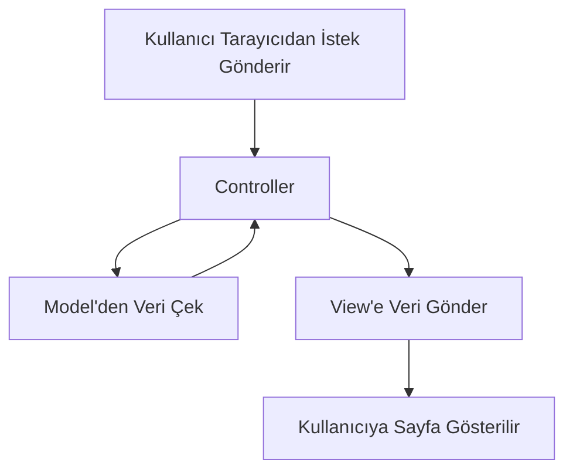

# 🧱 MVC Nedir?

**MVC**, "Model - View - Controller" kelimelerinin baş harflerinden oluşur. Bir yazılım mimarisidir. Kodun **katmanlara ayrılarak** daha düzenli, okunabilir ve sürdürülebilir olmasını sağlar.

---

## 🔹 1. Model (Veri Katmanı)

- **Veritabanıyla iletişim kurar.**
- Laravel'de **Eloquent ORM** kullanılarak yazılır.
- Örnek: `User`, `Product`, `Post` gibi veritabanı tablolarını temsil eder.

```php
// app/Models/User.php
class User extends Model
{
    // users tablosunu temsil eder
}
```

---

## 🔹 2. View (Görünüm Katmanı)

- **Kullanıcıya gösterilen arayüzdür.**
- Laravel'de `resources/views` içinde yer alır.
- Blade Template Engine ile yazılır: `home.blade.php`, `profile.blade.php` vs.

```blade
<!-- resources/views/home.blade.php -->
<h1>Merhaba, {{ $user->name }}</h1>
```

---

## 🔹 3. Controller (Kontrolcü Katman)

- **İş mantığını yönetir.**
- Model ile View arasında köprü kurar.
- Örnek: `UserController`, `PostController` gibi sınıflar kullanıcıdan gelen isteği alır, veriyi modelden çeker ve view'e yollar.

```php
// app/Http/Controllers/UserController.php
class UserController extends Controller
{
    public function show($id) {
        $user = User::find($id);
        return view('profile', ['user' => $user]);
    }
}
```

---

## 🔁 MVC Akışı



---

## 🎯 Laravel ve MVC

Laravel, MVC yapısını çok net bir şekilde uygular:

- `app/Models/` ➝ Modeller
- `resources/views/` ➝ Görünümler
- `app/Http/Controllers/` ➝ Kontrolcüler

Bu sayede kodun her parçası **tek bir sorumluluğa sahip olur**, karmaşadan uzak durulur.

---
