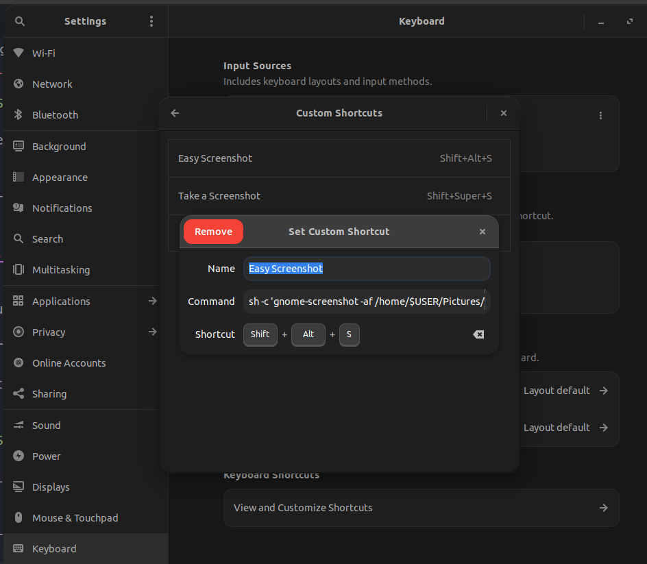

## Genel Güncelleme İşlemleri

```BASH
sudo apt update -y
sudo apt upgrade -y
```

## .Bashrc komutlarım

```BASH
# Disk alanını anlamlı gösterir
alias disk='du -h'
# Güncelleme işlemi
alias gunaydin='sudo apt update --fix-missing -y && sudo apt upgrade -y && sudo apt autoremove -y'
# Komut satırında gün,tarih,saat,isim gibi bilgileri gösterme
PS1="\n\[\e[35m\]\D{%Y-%m-%d}, \t\[\e[m\] \[\e[31m\]\u\[\e[m\]@\[\e[36m\]KaanPc\[\e[m\]:\[\e[32m\]\w\[\e[m\]\n\$ "
# Sanal makine başlatma
alias startserver='VBoxManage startvm "UbuntuServer" --type headless'
# Sanal makine durdurma
alias stopserver='VBoxManage controlvm "UbuntuServer" acpipowerbutton'

```

## Faydalı Paketler

```BASH
# Sık kullanılan faydalı paketleri kur
sudo apt install ffmpeg gnupg wine  imagemagick guake guake-indicator pv meld vim axel ncdu xclip net-tools caffeine magic-wormhole gnome-sushi hwinfo hardinfo gnome-shell-extension-manager software-properties-common apt-transport-https wget curl gnome-screenshot xclip -y
```

## Ekran görüntüsü kurulum ve ayarlar

Aşağıdaki komut ile `gnome-screenshot` ve `xclip` kurulur.

```BASH
# gnome-screenshot ve xclip kurulumu
sudo apt install gnome-screenshot xclip -y
```

Daha sonra aşşığıdaki ayarlar yapılır:

Ayarlar | Klavye | Klavye Kısayolları | Kısayolları Gör ve Özelleştir | Özel Kısayollar | menüsünden yeni `+`tuşuna basarak kısayol tanımlanır. Resimler dizinine bu ekran görüntülerini kaydetmek için KOMUT kısmına aşağıdaki komut girilir:

> **Note**:Bilgisayar dili ingilizce olanlar için:

> Settings | Keyboard | Keyboard Shortcuts | View and Customize Shortcuts | Custom Shortcuts | menüsünden `+` tuşuna basarak yeni kısayol tanımlanır. Name alanına istediğiniz ismi verebilirsiniz. `Pictures` dizinine bu ekran görüntülerini kaydetmek için COMMAND kısmına aşağıdaki komut girilir:

```BASH
sh -c 'gnome-screenshot -af /home/$USER/Resimler/$(date "+%Y.%m.%d-%H.%M.%S").png'
```

Son olarak `Kısayol Ayarla` diyerek istediğiniz kombinasyonu ayarlayabilirsiniz:

örnek: <kbd>Shift</kbd> + <kbd>Alt</kbd> + <kbd>S</kbd>

> **Note**: Eğer ekran görüntüsü aldığınız halde ekran görüntüsü kaydedilmemişse aşşığıdaki komutu girerek resim klasörüne izin verin.

```BASH
sudo chmod ugo+rwx /home/$USER/Resimler/*
```

> Verdiğiniz izni geri almak için aşağıdaki komutu girin:

```BASH
sudo chmod ugo-rwx /home/$USER/Resimler/*
```

> **Note**:Bilgisayar dili ingilizce olanlar için: Resimler yerine Pictures yazmalısınız.



## Oracle VirtualBox Kurulumu

```BASH
wget -q https://www.virtualbox.org/download/oracle_vbox_2016.asc -O- | sudo apt-key add -
echo "deb [arch=amd64] https://download.virtualbox.org/virtualbox/debian $(lsb_release -cs) contrib" | sudo tee /etc/apt/sources.list.d/virtualbox.list
sudo apt update
sudo apt install virtualbox-7.0
```

> **Note**: Kurulumda **kernel hatası alarsanız bu linkteki** çözümü uygulayın.

> [Kernel Hata Çözümü](https://superuser.com/questions/1285964/how-to-fix-and-prevent-virtualbox-kernel-driver-not-installed)

## GIT Kurulumu

```BASH
sudo apt install git -y
git config --global user.email 'durdu.kaan.kaltakkiran@gmail.com'
git config --global user.name 'Kaan Kaltakkıran'
```

## Apache Kurulumu

```BASH
sudo apt install apache2 apache2-utils -y
sudo rm -f /var/www/html/index.html
sudo systemctl enable apache2
sudo service apache2 restart
```

## Apache Dizin Ayarları

```BASH
sudo adduser $USER www-data
sudo chown -R $USER:www-data /var/www/html/
```

## Masaüzerine HTML klasörü kısayolunun açılması

```BASH
 cd ~/Desktop
ln -s /var/www/html/
sudo rm -f /var/www/html/index.html
```

## Php 7.4 Kurulumu

```BASH
sudo add-apt-repository -y ppa:ondrej/php
sudo apt update
sudo apt install php7.4-intl php7.4-imagick php7.4-dev php7.4-zip php7.4-curl php7.4-xmlrpc php7.4-sqlite3 php7.4-gd php7.4-mysql php7.4-mbstring php7.4-pgsql php7.4-xml php7.4-redis libapache2-mod-php7.4 -y
sudo apt install composer -y
sudo service apache2 restart
```

> **Note**: php7.4-imagick hatasını kontrol et

## 2 farklı PHP sürümü kurma ve bunları kullanma

```bash
# PHP 7.4 Sürümünü kur
sudo apt install php7.4-intl php7.4-imagick php7.4-dev php7.4-zip php7.4-curl php7.4-xmlrpc php7.4-sqlite3 php7.4-gd php7.4-mysql php7.4-mbstring php7.4-pgsql php7.4-xml php7.4-redis libapache2-mod-php7.4 -y

# PHP 8.1 Sürümünü kur
sudo apt install php8.1-intl php8.1-imagick php8.1-dev php8.1-zip php8.1-curl php8.1-xmlrpc php8.1-sqlite3 php8.1-gd php8.1-mysql php8.1-mbstring php8.1-pgsql php8.1-xml php8.1-redis libapache2-mod-php8.1 -y

# PHP 8.1'i devre dışı bırak
sudo a2dismod php8.1
# PHP 7.4'ü etkinleştir
sudo a2enmod php7.4
# Değişikliğin geçerli olabilmesi için apache servisini yeniden başlat
sudo service apache2 restart

## CLI için PHP sürümü ayarlama
sudo update-alternatives --config php
sudo update-alternatives --set php /usr/bin/php7.4

```

## Adminer Kurulumu

```BASH
mkdir /var/www/html/adminer
wget -O /var/www/html/adminer/index.php https://www.adminer.org/latest.php
```

> **Note**: Adminer programını kullanmak için [adrese](http://127.0.0.1/adminer) tıklayın.

## MySQL / MariaDB Kurulumu

```BASH
# MySQL / MariaDB kurulumu
sudo apt install mariadb-server mariadb-client -y
# Sistem açıldığında MySQL servisini otomatik başlat
sudo systemctl enable mariadb
# MySQL servisini yeniden başlat
sudo service mariadb restart

# MySQL Root kullanıcısı için şifreyi değiştir
# sudo mysql_secure_installation
sudo mysql --user="root" --password="" --execute="SET PASSWORD FOR 'root'@'localhost' = PASSWORD('root');"
```

## Node.js ve Npm kurulumu

```BASH
curl -o- https://raw.githubusercontent.com/nvm-sh/nvm/v0.39.7/install.sh | bash
nvm install 20
node -v
npm -v
```

## Doğru kurulum yapıldığının test edilmesi

```BASH
npm -v
node -v
php -v
apache2 -v
mysql --version
```

## AnyDesk Kurulumu

```BASH
wget -qO - https://keys.anydesk.com/repos/DEB-GPG-KEY | sudo apt-key add -
echo "deb http://deb.anydesk.com/ all main" | sudo tee
/etc/apt/sources.list.d/anydesk-stable.list
sudo cp /etc/apt/trusted.gpg /etc/apt/trusted.gpg.d
sudo apt update
sudo apt install anydesk
```

## Gnome-sushi Paketi Kurulumu

```BASH
sudo apt install gnome-sushi
```

## Ffmpeg Paketi Kurulumu

```BASH
sudo apt install  ffmpeg
```

## Imagemagick Paketi Kurulumu

```BASH
sudo apt install imagemagick
```

## Magic-wormhole Paketi Kurulumu

```BASH
sudo apt install magic-wormhole
```

## Metin editör Paketi Kurulumu

```BASH
sudo apt install vim
```

## Postman Kurulum

```BASH
sudo snap install postman
```

## Vscode Kurulumu

```BASH
wget -O- https://packages.microsoft.com/keys/microsoft.asc | sudo gpg --dearmor | sudo tee /usr/share/keyrings/vscode.gpg
echo deb [arch=amd64 signed-by=/usr/share/keyrings/vscode.gpg] https://packages.microsoft.com/repos/vscode stable main | sudo tee /etc/apt/sources.list.d/vscode.list
sudo apt update
sudo apt install code -y
```

## Vscode Extension Kurulumu

```BASH
# Auto Close Tag eklentisi
code --install-extension formulahendry.auto-close-tag
# Auto Rename Tag eklentisi
code --install-extension formulahendry.auto-rename-tag
# Better Comments eklentisi
code --install-extension aaron-bond.better-comments
# CodeSnap eklentisi
code --install-extension adpyke.codesnap
# DotENV eklentisi
code --install-extension mikestead.dotenv
# Duplicate action eklentisi
code --install-extension mrmlnc.vscode-duplicate
# Error Lens eklentisi
code --install-extension usernamehw.errorlens
# ESLint eklentisi
code --install-extension dbaeumer.vscode-eslint
# Excel Viewer  eklentisi
code --install-extension GrapeCity.gc-excelviewer
# Git Graph  eklentisi
code --install-extension mhutchie.git-graph
# Git History eklentisi
code --install-extension donjayamanne.githistory
# Git Stash  eklentisi
code --install-extension arturock.gitstash
# GitHub Copilot eklentisi
code --install-extension GitHub.copilot
# GitLens — Git supercharged eklentisi
code --install-extension eamodio.gitlens
# Highlight Matching Tag eklentisi
code --install-extension vincaslt.highlight-matching-tag
# HTML CSS Support eklentisi
code --install-extension ecmel.vscode-html-css
# Image preview  eklentisi
code --install-extension kisstkondoros.vscode-gutter-preview
# JavaScript (ES6) code snippets eklentisi
code --install-extension xabikos.JavaScriptSnippets
# json2ts eklentisi
code --install-extension GregorBiswanger.json2ts
# Live Server eklentisi
code --install-extension ritwickdey.LiveServer
# npm Intellisense eklentisi
code --install-extension christian-kohler.npm-intellisense
# One Dark Pro eklentisi
code --install-extension zhuangtongfa.Material-theme
# Path Intellisense eklentisi
code --install-extension christian-kohler.path-intellisense
# PHP Intelephense eklentisi
code --install-extension bmewburn.vscode-intelephense-client
# Prettier - Code formatter eklentisi
code --install-extension esbenp.prettier-vscode
# Rainbow CSV eklentisi
code --install-extension mechatroner.rainbow-csv
# SVG eklentisi
code --install-extension jock.svg
# Thunder Client eklentisi
code --install-extension rangav.vscode-thunder-client
# TODO Highlight eklentisi
code --install-extension wayou.vscode-todo-highlight
# Vetur eklentisi
code --install-extension  octref.vetur
# Vue.js Extension Pack eklentisi
code --install-extension mubaidr.vuejs-extension-pack
# Vue - Official eklentisi
code --install-extension  Vue.volar
# Vue 3 Snippets eklentisi
code --install-extension hollowtree.vue-snippets
# vscode-icons eklentisi
code --install-extension vscode-icons-team.vscode-icons
# vscode-pdf eklentisi
code --install-extension tomoki1207.pdf
# WakaTime eklentisi
code --install-extension WakaTime.vscode-wakatime
# indent-rainbow eklentisi
code --install-extension oderwat.indent-rainbow

```

## Snap Store Kurulumu

```BASH
sudo apt update
sudo apt install snapd
```

## Vlc Kurulumu

```BASH
sudo snap install vlc
```

## Spotify Kurulumu

```BASH
curl -sS https://download.spotify.com/debian/pubkey_6224F9941A8AA6D1.gpg | sudo gpg --dearmor --yes -o /etc/apt/trusted.gpg.d/spotify.gpg
echo "deb http://repository.spotify.com stable non-free" | sudo tee /etc/apt/sources.list.d/spotify.list
sudo apt-get update && sudo apt-get install spotify-client
```

## Discord Kurulumu

```BASH
sudo snap install discord
```

## Prospect-mail Kurulumu

```BASH
sudo snap install prospect-mail
```

## ulauncher kurulumu

```BASH
sudo add-apt-repository universe -y && sudo add-apt-repository ppa:agornostal/ulauncher -y && sudo apt update && sudo apt install ulauncher
```

## Guake Terminal Kurulumu

```BASH
sudo apt install guake
```

## Gnome extansion manager kurulumu

```BASH
sudo apt install gnome-shell-extension-manager
```
