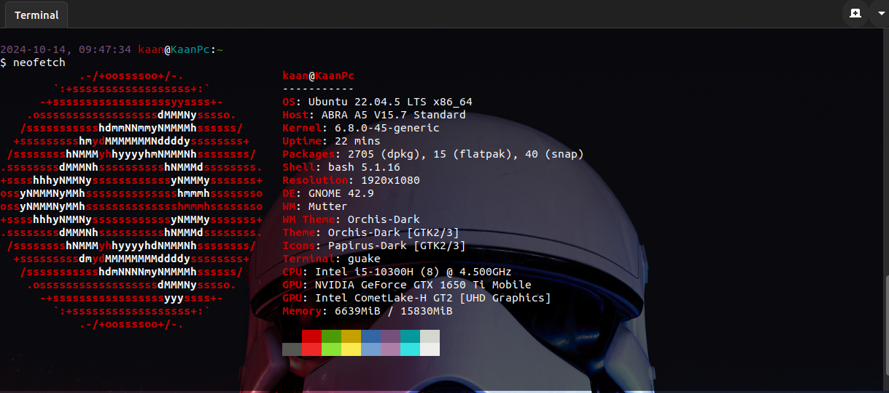

# Ubuntu 22.04(LTS) Kurulum Notları

- [Detaylı Kurulum Notlarım](https://github.com/kaankaltakkiran/Linux_notlarim/tree/main/ubuntu_kurulum_notlarim/detayli_kurulum)

- [Hazırladığım Scriptler](https://github.com/kaankaltakkiran/Linux_notlarim/tree/main/ubuntu_kurulum_notlarim/script_notlarim)



## Hızlı Kurulum

```bash
wget https://raw.githubusercontent.com/kaankaltakkiran/Linux_notlarim/refs/heads/main/ubuntu_kurulum_notlarim/my_setup_commands.sh -O - | sh
```

### Kurulum İçeriği

````bash
# Depolarda yer alan paketlerin güncel listesini indir
sudo apt update
# Mevcut paketlerin yenisi varsa yükle
sudo apt upgrade

# Sürücülerin (driver) güncel dosyalarını yükle
sudo ubuntu-drivers autoinstall

# Flatpak Kurulumu
sudo apt install flatpak -y
sudo apt install gnome-software-plugin-flatpak -y

# Sık kullanılan faydalı paketleri kur
sudo apt install ffmpeg wine  imagemagick guake guake-indicator pv meld vim axel ncdu  net-tools caffeine magic-wormhole gnome-sushi hwinfo hardinfo gnome-shell-extension-manager software-properties-common apt-transport-https wget curl gnome-screenshot xclip neofetch  -y

# Apache kurulumu
sudo apt install apache2 apache2-utils -y
## Apache varsayılan dosyasını sil
sudo rm -f /var/www/html/index.html
## Sistem açıldığında apache servisini otomatik başlat
sudo systemctl enable apache2
## Apache servisini yeniden başlat
sudo service apache2 restart
## Aktif kullanıcıyı Apache'nin varsayılan grubuna ekle (www-data)
sudo adduser $USER www-data
## Apache'nin varsayılan dizinine aktif kullanıcıyı yetkilendir
sudo chown -R $USER:www-data /var/www/html/

# Php 7.4 Kurulumu
sudo add-apt-repository -y ppa:ondrej/php

# vscode kurulumu
## vscode için güvenilir depolara vscode'un kendi deposunu ve imzasını ekle
wget -O- https://packages.microsoft.com/keys/microsoft.asc | sudo gpg --dearmor | sudo tee /usr/share/keyrings/vscode.gpg
echo deb [arch=amd64 signed-by=/usr/share/keyrings/vscode.gpg] https://packages.microsoft.com/repos/vscode stable main | sudo tee /etc/apt/sources.list.d/vscode.list

# SublimeMerge kurulumu
sudo apt-get install apt-transport-https
wget -qO - https://download.sublimetext.com/sublimehq-pub.gpg | gpg --dearmor | sudo tee /etc/apt/trusted.gpg.d/sublimehq-archive.gpg > /dev/null
echo "deb https://download.sublimetext.com/ apt/stable/" | sudo tee /etc/apt/sources.list.d/sublime-text.list

# AnyDesk kurulumu
wget -qO - https://keys.anydesk.com/repos/DEB-GPG-KEY | sudo apt-key add -
echo "deb http://deb.anydesk.com/ all main" | sudo tee
/etc/apt/sources.list.d/anydesk-stable.list
sudo cp /etc/apt/trusted.gpg /etc/apt/trusted.gpg.d

# Spotify kurulumu
curl -sS https://download.spotify.com/debian/pubkey_6224F9941A8AA6D1.gpg | sudo gpg --dearmor --yes -o /etc/apt/trusted.gpg.d/spotify.gpg
echo "deb http://repository.spotify.com stable non-free" | sudo tee /etc/apt/sources.list.d/spotify.list

# Docker kurulumu
sudo apt-get install ca-certificates curl
sudo install -m 0755 -d /etc/apt/keyrings
sudo curl -fsSL https://download.docker.com/linux/ubuntu/gpg -o /etc/apt/keyrings/docker.asc
sudo chmod a+r /etc/apt/keyrings/docker.asc

echo "deb [arch=$(dpkg --print-architecture) signed-by=/etc/apt/keyrings/docker.asc] \
https://download.docker.com/linux/ubuntu $(. /etc/os-release && echo "$VERSION_CODENAME") stable" \
| sudo tee /etc/apt/sources.list.d/docker.list > /dev/null

# Syncthing kurulumu

# Add the release PGP keys:
sudo mkdir -p /etc/apt/keyrings
sudo curl -L -o /etc/apt/keyrings/syncthing-archive-keyring.gpg https://syncthing.net/release-key.gpg
# Add the "stable" channel to your APT sources:
echo "deb [signed-by=/etc/apt/keyrings/syncthing-archive-keyring.gpg] https://apt.syncthing.net/ syncthing stable" | sudo tee /etc/apt/sources.list.d/syncthing.list
# Add the "candidate" channel to your APT sources:
echo "deb [signed-by=/etc/apt/keyrings/syncthing-archive-keyring.gpg] https://apt.syncthing.net/ syncthing candidate" | sudo tee /etc/apt/sources.list.d/syncthing.list


# Floorp Web Tarayıcısı Kurulumu

curl -fsSL https://ppa.ablaze.one/KEY.gpg | sudo gpg --dearmor -o /usr/share/keyrings/Floorp.gpg
sudo curl -sS --compressed -o /etc/apt/sources.list.d/Floorp.list 'https://ppa.ablaze.one/Floorp.list'

# Brave Web Tarayıcısı Kurulumu
sudo curl -fsSLo /usr/share/keyrings/brave-browser-archive-keyring.gpg https://brave-browser-apt-release.s3.brave.com/brave-browser-archive-keyring.gpg

echo "deb [signed-by=/usr/share/keyrings/brave-browser-archive-keyring.gpg] https://brave-browser-apt-release.s3.brave.com/ stable main"|sudo tee /etc/apt/sources.list.d/brave-browser-release.list

# Tor Browser Web Tarayıcısı Kurulumu

sudo apt install torbrowser-launcher -y

# Depolarda yer alan paketlerin güncel listesini indir

sudo apt update -y

# Spotify, Anydesk, SublimeMerge, Vscode, Docker, Syncthing, Floorp, Brave kurulum

sudo apt install spotify-client anydesk sublime-merge code docker-ce docker-ce-cli containerd.io docker-buildx-plugin docker-compose-plugin syncthing floorp brave-browser -y

## PHP 7.4 yükle

sudo apt install php7.4-intl php7.4-imagick php7.4-dev php7.4-zip php7.4-curl php7.4-xmlrpc php7.4-sqlite3 php7.4-gd php7.4-mysql php7.4-mbstring php7.4-pgsql php7.4-xml php7.4-redis libapache2-mod-php7.4 -y

## PHP composer paketini kur

sudo apt install composer -y

## PHP'nin çalışmaya başlaması için Apache'yi yeniden başlat

sudo service apache2 restart

# MySQL / MariaDB kurulumu

sudo apt install mariadb-server mariadb-client -y

## Sistem açıldığında MySQL servisini otomatik başlat

sudo systemctl enable mariadb

## MySQL servisini yeniden başlat

sudo service mariadb restart

# MySQL Root kullanıcısı için şifreyi değiştir

## mysql parola belirleme

sudo mysql --user="root" --password="" --execute="SET PASSWORD FOR 'root'@'localhost' = PASSWORD('root');"

# Syncthing servis başlatma

sudo systemctl enable syncthing@kaan.service
sudo systemctl start syncthing@kaan.service
systemctl status syncthing@kaan.service

# Syncthing port izin verme

sudo ufw allow 22000/tcp
sudo ufw enable

# Adminer Kurulumu

mkdir /var/www/html/adminer
wget -O /var/www/html/adminer/index.php https://www.adminer.org/latest.php

# Fare için ayarlar

## Dock ünitesinde program simgesine tıklayınca küçült/büyült

gsettings set org.gnome.shell.extensions.dash-to-dock click-action 'minimize'

## Dock ünitesinde program simgesinde tekeri çevirince pencelere arasında gezin

gsettings set org.gnome.shell.extensions.dash-to-dock scroll-action 'cycle-windows'

# Guake terminal kurulumu

sudo apt install guake -y

# Gnome Extansion Manger Kurulumu

sudo apt install gnome-shell-extension-manager -y

# Flatpak Alpaca Kurulum
flatpak install flathub com.jeffser.Alpaca -y

# Snap Store kurulumu

sudo apt install snapd

# Snap Store vlc,discord,telegram, prospect-mail, postman, chromium kurulum

sudo snap install vlc discord telegram-desktop prospect-mail postman chromium

#### Snap Store obsidian, micro, identity, mousai, czkawka, onionshare, gimp, localsend, onlyoffice kurulum
sudo snap install obsidian --classic && sudo snap install micro --classic && sudo snap install identity && sudo snap install mousai && sudo snap install czkawka && sudo snap install onionshare && sudo snap install gimp && sudo snap install localsend  &&  sudo snap install onlyoffice-desktopeditors

# Node.js ve Npm İçin Nvm Kurulumu

curl -o- https://raw.githubusercontent.com/nvm-sh/nvm/v0.39.7/install.sh | bash

# GIT ayarları

sudo apt install git -y
git config --global user.email 'durdu.kaan.kaltakkiran@gmail.com'
git config --global user.name 'Kaan Kaltakkıran'

# Doğru kurulum yapıldığının test edilmesi

npm -v
node -v
php -v
apache2 -v
mysql --version
docker --version
syncthing --version
flatpak --version


echo "\n\n\n=== KURULUM TAMAMLANDI ===\n\n\n"

```

```
````
